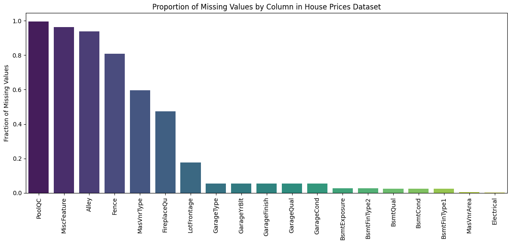
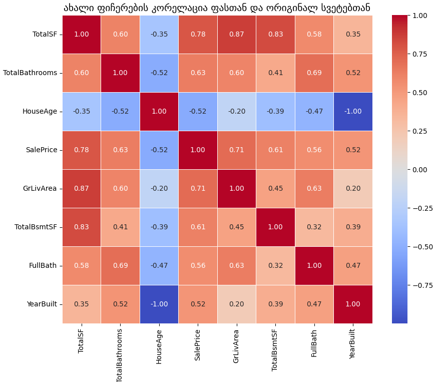
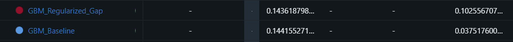

# MachineLearning---House-Prices
Machine Learning Project 1 

House Prices: Advanced Regression Techniques
https://www.kaggle.com/competitions/house-prices-advanced-regression-techniques

## პროექტის მიმოხილვა
პროექტის მიზანია ამერიკის ერთ-ერთ შტატში საცხოვრებელი სახლების ფასების პროგნოზირება 79 Feature-ის დახმარებით.

---

## მიდგომა პრობელმის გადასაჭრელად
ვეცადე გამეტესტა არაერთი ვარიაცია Data-ს დამუშავების , მონაცემების გასუფთავების, სვეტების ამოშლა/ჩამატებისა. ასევე გავტესტე არაერთი მოდელი  სხვადასხვა ჰიპერპარამეტრებით, დავლოგე MLflow-ზე და გამოვიტანე დასკვნები, რომელიც ჩემს მოდელს უკეთესად აქცევდა.

---

## რეპოზიტორიის სტრუქტურა
* **model_experiment.ipynb** მონაცემების დამუშავების და მოდელის ექსპერიმენტები.
* **inference.ipynb** საუკეთესო მოდელის გამოძახება Model Registry-დან და Kaggle-ზე გაგზავნა.
* **assets** გრაფიკები
* **README.md**: პროექტის აღწერა.

---

## Cleaning & Feature Engineering

პირველ ვრიგში ვნახე სვეტები სადაც null ები მქონდა 

    
  <i>გამოტოვებული მნიშვნელობების ანალიზი House Prices დატასეტში</i>

ჩავატარე ექსპერიმენტი ორ მიდგომაზე:
1. იმ სვეტების ამოშლა, სადაც ბევრი მონაცემი აკლდა.

2. მათი შენარჩუნება და შევსება.

ვინაიდან ორივე შემთხვევაში მოდელმა ფაქტობრივად იდენტური შედეგი აჩვენა, გადავწყვიტე შემენარჩუნებინა ყველა სვეტი, რათა მაქსიმალურად ამომეწურა მონაცემების პოტენციალი. 
კატეგორიული ცვლადების რიცხვით ფორმატში გადასაყვანად გამოვიყენე One-Hot Encoding. ეს აუცილებელი ნაბიჯი იყო იმისთვის, რომ მოდესლ შეძლებოდა კატეგორიული მონაცემების აღქმა.
გამოტოვებული მნიშვნელობები შეივსო სტატისტიკური მაჩვენებლებით: მედიანით და მოდათი .

---

მოდელის სიზუსტის გაუმჯობესების მიზნით შევქმენი 3 ახალი ფიჩერი:

1. TotalSF - გავაერთიანე სარდაფის , პირველი და მეორე სართულის ფართობები.
2. TotalBathrooms - გავაერთიანე აბაზანები.
3. HouseAge - ასახავს სახლის სიძველეს.

 **შედეგი** : 

    
  <i>გრაფიკი: ახალი ფიჩერების კორელაცია SalePrice-თან</i>

1.როგორც გრაფიკზე ვხედავთ TotalSF(0.78 კორ.) საკმაოდ ღირებული ფიჩერია. როგორც აღმოჩნდა ფასის გარკვევისთვის ბევრად ღირებულია საერთო ფართობის სტატისტიკა.

2.აბაზანების გაერთიანებამ TotalBathrooms(0.63 კორ.) უფრო მაღალი კავშირი აჩვენა ფასთან,ვიდრე ცალკე აღებულმა FullBath-მა (0.63>0.56)

3.HouseAge(-0.52 კორ.)-ც საკმაოდ ღირებული ფიჩერია , რაც უფრო იზრდება სახლის ასაკი,მით უფრო იკლებს ღირებულბა და ის საკმაო კავშირშია სახლის ღირებულებასთან.
 

## Feature Selection

თავდაპირველად მოდელი გავუშვი ყოველგვარი ფიჩერების გადარჩევის გარეშე, მივიღე ძალიან დაბალი RMSLE ტრეინინგზე, მაგრამ მაღალი RMSLE ვალიდაციაზე , შედეგად დავასკვენი , რომ ტრეინინგსა და ვალიდაციას შორის არსებული დიდი გეპი პირდაპირ მიუთითებდა ოვერფიტინგზე. მოდელმა დაისწავლა ტრეინინგ მონაცემების ხმაური და ვერ შეძლო ახალი მონაცემების სწორად პროგნოზირება.

ამის შემდეგ ვცადე კორელაციის თრეშოლდის დახმარებით მიმეღწია იდეალური შედეგისთვის: 

პირველ ვრიგში ვცადე კორელაციის თრეშოლდის ძალიან მაღლა აწევა (მაგ. 0.1)(ლოგებში ნახავთ რომ თრეშოლდზე საკმაოდ ბევრი ვიწავალე , რათა იდეალური ვრიანტისთვის მიმეღწია), რის შედეგადაც მხოლოდ 30-40 სვეტი დარჩა.შედეგად ორივე (Train და Valid) გაუარესდა და ერთმანეთს მიუახლოვდა. ეს იყო underfitting-ის მაგალითი. მოდელი ზედმეტად მარტივი გახდა და ვეღარ აღიქვამდა მონაცემებში არსებულ კანონზომიერებებს.

ამის შემდეგ მივაღწიე სასურველ თრეშოლდს - 0.089,რითაც ტრეინინგისა და ვალიდაციის RMSLE-ებს შორის სხვაობა მინიმუმამდე დავიდა. მოდელი აღარ არის მგრძნობიარე მცირე ცვლილებების მიმართ, რაც იმის ნიშანია, რომ მან ისწავლა კანონზომიერება და არა ზედმეტი ხმაური.

ასევე მაქვს გრაფიკული გამოსახულება იმის საჩვენებლად თუ როგორ კორელაციაში არიან ფასთან ფიჩერები: 

    
  <i>გრაფიკი: ტოპ 20 მახასიათებლის კორელაცია SalePrice-თან (ფილტრაციის შემდეგ)</i>

**ოპტიმიზაცია RFE-ს მეშვეობით**

კორელაციური ფილტრაციის (0.089) შემდეგ, მოდელის კიდევ უფრო დასახვეწად გამოვიყენე RFE მეთოდი, რამაც გადამწყვეტი როლი ითამაშა საბოლოო სიზუსტეში.
ჩვეულებრივი კორელაცია ზომავს მხოლოდ ცალკეული ფიჩერის ინდივიდუალურ კავშირს ფასთან. RFE კი გაცილებით ხელსაყრელი მიდგომაა. ალგორითმი იტერაციულად აშორებს იმ ცვლადებს, რომლებიც მოდელს დახმარების მაგივრად უფრო ხელს უშლიან.
შედეგად RFE-ის გამოყენებამ კიდევ უფრო შეამცირა სხვაობა თრეინსა და ვალიდაციას შორის. მოდელმა მოიშორა ისეთი ფიჩერები, რომლებიც  რეალურად მხოლოდ ხმაურს ქმნიდნენ.

სწორედ RFE-ით გაფილტრული ვარიანტი დავტოვე საბოლოო მოდელად, რადგან მან აჩვენა საუკეთესო Generalization Ability - მოდელი თანაბრად სტაბილურია როგორც ნაცნობ, ისე სრულიად უცნობ მონაცემებზე.

## Training

**LINEAR REGRESSION**

პროექტის დასაწყისში გამოვიყენე სტანდარტული Linear Regression. წრფივმა რეგრესიამ საკმაოდ კარგი შედეგი აჩვენა, რაც იმის ნიშანია, რომ ფიჩერებსა და სახლის ფასს შორის კავშირი დიდწილად წრფივია. მიუხედავად კარგი შედეგისა, შეიმჩნეოდა მცირე აცდენა სატრენინგო და ვალიდაციის მონაცემებს შორის. ვინაიდან მოდელს ჰქონდა ბევრი ფიჩერი, არსებობდა რისკი, რომ მოდელი ზედმეტად მგრძნობიარე იქნებოდა მონაცემთა მცირე ხმაურის მიმართაც და ამიტომაც გადავწყვიტე კიდევ უფრო სტაბილიზაციისთვის გამომეყენბინა RIDGE იგივე L2 REGRESSION

**RIDGE REGRESSION**

Ridge რეგრესია ამატებს მცირე "ჯარიმას" დიდ კოეფიციენტებს, რაც მოდელს უფრო მდგრადს ხდის. Ridge-მა ოდნავ გააუმჯობესა ვალიდაციის RMSLE და რაც მთავარია, შეამცირა სხვაობა Train და Valid RMSLE შორის.

Linear Regression: ჰქონდა ძალიან დაბალი Bias (ზუსტად ერგებოდა ტრეინინგს), მაგრამ ოდნავ მაღალი Variance.

Ridge: მცირე რეგულარიზაციით მოახდინა ამ Variance-ის Shrinkage. ამით მივაღწიე უკეთეს გენერალიზაციას ისე, რომ მოდელის სიზუსტე არ დამიკარგავს.

**ჰიპერპარამეტრების ოპტიმიზაცია Alpha**

გავტესტე რამდენიმე მიდგომა (რაც ლოგებში დეტალურად ჩანს შესაბამისი ჰედლაინებით):

1. მცირე Alpha-ს ტესტირება (მაგ. Alpha < 1)
    მიდრეკილება Overfitting-ისკენ. როდესაც Alpha მცირეა, მოდელი თითქმის ჩვეულებრივი Linear Regression-ივით იქცევა. რეგულარიზაციის ეფექტი სუსტია. სატრენინგო მონაცემებზე მოდელი აჩვენებდა ძალიან მაღალ სიზუსტეს, მაგრამ ვალიდაციაზე RMSLE ოდნავ იზრდებოდა,რაც მიუთითებდა High Variance-ზე. მოდელი ზედმეტად ერგებოდა ტრეინინგის ხმაურს, რაც აფერხებდა მის გენერალიზაციას.

2. დიდი Alpha-ს ტესტირება (მაგ. Alpha > 50)
    მიდრეკილება Underfitting-ისკენ. Alpha-ს მკვეთრი ზრდისას, მოდელი ხდება ზედმეტად ხისტი. ჯარიმა იმდენად დიდია, რომ მოდელი მნიშვნელოვან კოეფიციენტებსაც კი ზედმეტად ამცირებს. შედეგად ორივე მეტრიკა (Train და Valid RMSLE) ერთდროულად გაუარესდა.

3. ოპტიმალური წერტილი: Alpha = 15
    მრავალჯერადი ტესტირების შემდეგ დადგინდა, რომ Alpha = 15 იძლევა საუკეთესო შედეგს. ამ წერტილში მივაღწიე საუკეთესო ბალანსს: ტრეინინგისა და ვალიდაციის RMSLE-ებს შორის სხვაობა მინიმალურია, ხოლო საერთო ცდომილება — ყველაზე დაბალი, რაც მიუთითებს მოდელის სტაბილურობაზე.

საბოლოო ანალიზი Alpha ჰიპერპარამეტრზე: მცირე მნიშვნელობებისას მოდელი მიდრეკილი იყო Overfitting-ისკენ, ხოლო ზედმეტად დიდი მნიშვნელობისას Underfitting-ისკენ. Alpha = 15 გამოდგა იდეალური პარამეტრი მოდელის სტაბილიზაციისთვის.

**DECISION TREE**

ასევე ჩავატარე ექსპერიმენტი Decision Tree ზე, რათა მენახა, როგორ გაართმევდა თავს არაწრფივი მოდელი ამ ამოცანას.

რეგრესიის ამოცანიდან გამომდინარე, გამოვიყენე Squared Error კრიტერიუმი. Overfitting-ის ნათელი მაგალითი იყო , რომ ,როცა თავდაპირველად მოდელი გავუშვი max_depth=10 ზე,შედეგად მოდელმა ტრეინინგზე ძალიან დაბალი ცდომილება აჩვენა(0.05 RMSLE), მაგრამ ვალიდაციაზე შედეგი ცუდი იყო(დაახლ. 0.21). ტრეინინგსა და ვალიდაციას შორის არსებული უზარმაზარი სხვაობა (0.16) მიუთითებს იმაზე, რომ 10 დონის სიღრმის ხემ ზედმეტად დაისწავლა ხმაური, რის გამოც მან დაკარგა Generalization-ის უნარი. ამის შემდეგ გრიდსერჩის დახმარებით ვცადე ხის სიღრმის შეზღუდვა (max_depth=5), რათა მოდელი უფრო ზოგადი გამხდარიყო,თუმცა საბოლოო შედეგი მაინც არ იყო დამაკმაყოფილებელი. RIDGE REGRESSION-ის შედეგი ბევრად უკეთესი იყო Decision Tree-ზე.
ლოგებში აპინული მაქვს ყველა მოდელით ნაცადი საუკეთესო ვარიანტი, ასევე model_experiment ში საბოლოო დალოგვისას ჩანს გამოყენებული ყველა მოდელის მიერ მხოლოდ საუკეთესო ვარიანტები. 

**RANDOM FOREST** 

Decision Tree-ს ოვერფიტინგის პრობლემის საპასუხოდ, გამოვიყენე Random Forest. ჩემი მიზანი იყო მენახა, რამდენად შეამცირებდა ბევრი ხის ერთობლიობა იმ მაღალ Variance-ს, რომელიც ერთმა ხემ აჩვენა.

Train RMSLEოდნავ გაიზარდა ერთ ხესთან შედარებით (რაც კარგია, რადგან მოდელმა ნაკლებად დაიზეპირა მონაცემები). Validation RMSLE მნიშვნელოვნად გაუმჯობესდა Decision Tree-სთან შედარებით (ჩამოვიდა დაახლოებით 0.14-0.15-მდე). საბოლოოდ Random Forest მა ნორმალური შედეგი მომცა თუმცა მაინც Ridge Regression ჯობდა

**GRADIENT BOOSTING**

მიუხედავად იმისა , რომ ამ მოდელს საფუძვლიანად არ ვიცნობ, მაინც გავტესტე ინტერესის გამო. 

როგორც ლოგში ჩანს, default პარამეტრებით ტრეინინგის RMSLE ძალიან დაბალი იყო, თუმცა ვალიდაციის ბევრად მაღალი, რაც კიდევ ერთხელ მიუთითებს OVERFITTING-ზე

მეორედ შევეცადე მოდელი ოდნავ უფრო რეგულარიზებული გამეხადა learning rate-ს და max_depthh-ის შეზღუდვით და ამან მართლაც შეამცირა RMSLE ს სხვაობა. საფუძვლიანად ამ მოდელის კველვას აღარ ჩავყევი.

##საბოლოო მოდელის შერჩევის დასაბუთება

მიუხედავად იმისა რომ Gradient Boosting-ში დავინახე პოტენციალი საუკეთესო მოდელად მაინც Ridge Regression დავტოვე. კვლევისა და ანალიზის შემდეგ დავინახე რომ Linear მოდელი ყველაზე კარგ გეპს მაძლევდა ვალიდაციასა და ტრენინგს შორის , ასევე მისი საბოლოო score-ც არც თუ ისე ცუდი აღმოჩნდა.

## MLflow tracking

ჩემი ლოგების/ექსპერიმენტების ბმული: 
https://dagshub.com/ndoda23/MachineLearning---House-Prices

